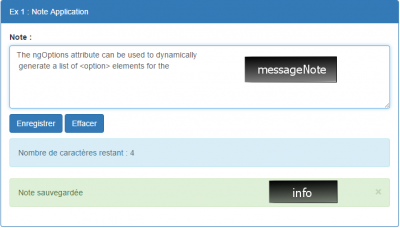
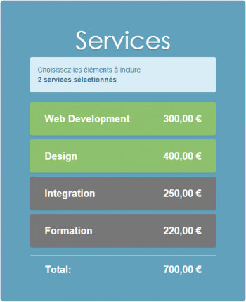

### Il est temps de faire de la gym :

 

Tous les exercices utilisent `Bootstrap` pour la partie CSS.
 [URL](https://maxcdn.bootstrapcdn.com/bootstrap/3.3.1/css/bootstrap.min.css)
 
> Allez on y est!

Créer un dossier différent pour chaque exercice, dans le même projet.

##Exo1 => Application Note :
* Objectif:
	* Créer un module et un contrôleur
	* Utiliser des directives Angular
	* Mettre en oeuvre le Data-binding
	
* Fonctionnalités:
	* Saisir une note (message textuel) et afficher le nombre de caractères restants (le message est limité à 100 caractères saisis)
	* Enregistrer (côté client en JS)
	* Effacer le contenu
	* Afficher les messages d'info (sauvegarde, modification…)
	* Gérer les changements de classe CSS sur l'affichage d'info
* Application/Contrôleurs:

Application |  Contrôlleur|
------------| ------------- | 
`NoteApp` (app/noteApp.js)| `NoteController` (app/noteController.js)  | 
| `MessageNote` : variable stockant le contenant de la note   | 
|`info` :message affiché (modifié,sauvegardé...) |
|`save()` :Met à jour le modèle (messageNote) |
|`clear()`:vide messageNote |
|`count()` :calcule le nombre de caractères restants (sur 100) |

* Vue:
	* Directive utilisées:
		* `ng-app`
		* `ng-change`
		* `ng-controller`
		* `ng-click`
		* `ng-model`
		* `ng-bind`
		* `ng-class`
		
	* INTERFACE :
	
	
	
> Libre à vous de l'amélioré hein!
	
   * Logique applicative / comportement de l'interface
   	* sur saisie dans la zone `messageNote` (textarea), le nombre de caractères restants est indiqué
		* la zone info apparaît et indique “note modifiée” dès que `messageNote` est modifié, avec le style `alert-warning`
		*  Le style de la zone info passe à `alert-danger` si le nombre de caractères restant est inférieur à 10
	* Sur enregistrement (à condition que le message ne soit pas vide) :
		* la zone `info` affiche “note sauvegardée” et sont style passe à `alert-success`
	* Sur effacement (à condition que le message ne soit pas vide) :
		* la zone `info` disparaît
	
##Exo2 => Choix de services:
 * Objectifs

	* Créer un module et un contrôleur
	* Utiliser des directives Angular
	* Mettre en oeuvre le Data-binding
- Fonctionnalités

	* Sélectionner/désélectionner des services.
	* Calculer le montant dû.
	* Afficher le nombre de services sélectionnés.
- Application/Contrôleurs:

Application |  Contrôlleur|
------------| ------------- | 
`ServicesApp` (app/servicesApp.js)| `ServicesController` (app/servicesController.js)  | 
| `services` : Tableau des services disponibles défini en JSON| 
|`total()`: Calcul le total des services actifs|
|`toggleActive()`:Change le statut d'un service |

`Services` : à intégrer dans le contrôleur

	[
    {
        name: 'Web Development',
        price: 300,
        active:true
    },{
        name: 'Design',
        price: 400,
        active:false
    },{
        name: 'Integration',
        price: 250,
        active:false
    },{
        name: 'Formation',
        price: 220,
        active:false
    }
	]
Ressources : [fichers zone fr](./fr.zip)

##- Vue :

* Directives utilisées:
	* ng-app
	* ng-controller
	* ng-repeat
	* ng-class
	* ng-pluralize
	* Expressions {{expression}}
Filtre : currency
* INTERFACE :

* Logique applicative / comportement de l'interface

	* Le service `Web development` est sélectionné par défaut
	* La classe css d'un service sélectionné est égale à `active`
	* La sélection/dé-sélection met à jour l'affichage du nombre de services sélectionnés, ainsi que le `total`
 
####voilà pour vous!

